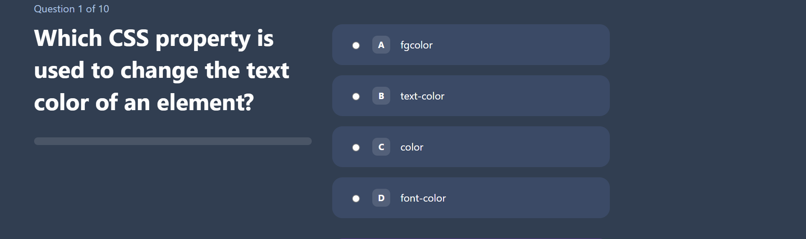
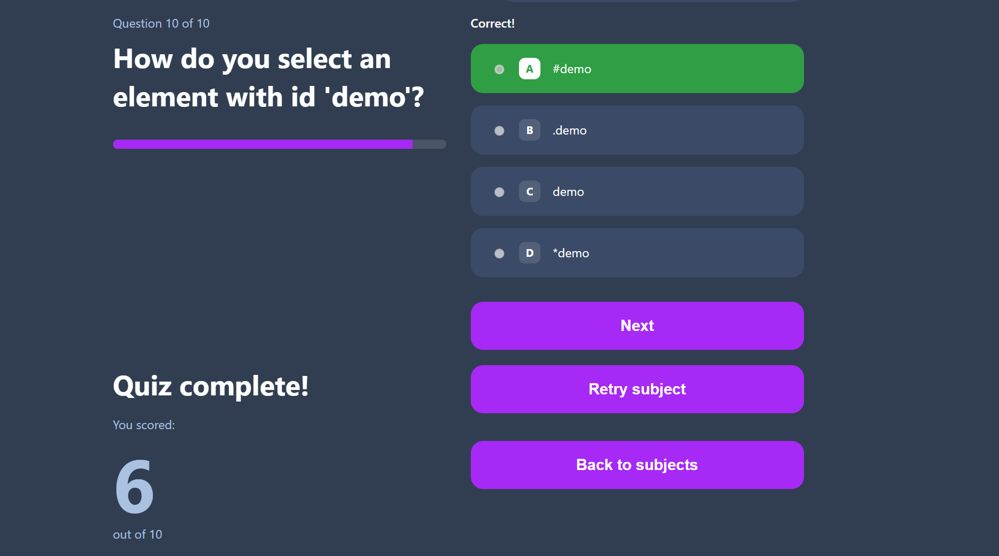

# Quiz App — HTML, CSS & JavaScript

An interactive quiz application where users can choose a subject, answer multiple‑choice questions, and see real‑time scoring. Includes dark/light theme and responsive UI.

## 🔗 Live Demo
- **Website:** https://devrejaul.github.io/quiz-app-html-css-js/

## ✨ Features
- Subject/category selection
- Multiple‑choice questions with instant feedback
- Score tracking and final result summary
- Dark/Light theme toggle
- Mobile‑friendly responsive layout
- Clean, vanilla HTML/CSS/JS — no frameworks required

## 🧰 Tech Stack
- HTML5
- CSS3 (with custom styles; optional SASS JSON config files present)
- JavaScript (vanilla)

## 📁 Project Structure
```
.
├── index.html
├── script.js
├── style.css
├── html.json         # question bank (HTML)
├── css.json          # question bank (CSS)
├── js.json           # question bank (JavaScript)
├── sass.json         # (optional) question bank / settings
└── frontend_quiz_flowchart/ (optional docs/diagram)
```

## 🚀 Getting Started (Run Locally)
1) Clone the repository
```bash
git clone https://github.com/devrejaul/quiz-app-html-css-js.git
cd quiz-app-html-css-js
```
2) Open `index.html` directly in your browser **or** run a simple local server:
```bash
# Python 3
python -m http.server 5500
# then open http://localhost:5500
```

## 🧪 How to Use
1) Choose a subject (HTML/CSS/JS)  
2) Answer the MCQs — the app validates choices  
3) View your **score** and **summary** at the end  
4) Toggle **Dark/Light** theme any time

## 🖼️ Screenshots
> Save your screenshots to the `img/` folder with the following names (then they will render below).
```
frontend_quiz_flowchart/
├── screenshot-home.png
├── screenshot-quiz.png
└── screenshot-result.png
```

| Home | Quiz | Result |
|------|-----|--------|
|  |  |  |

## 🌐 Deploy on GitHub Pages
1. Push code to the `main` branch.  
2. GitHub → **Settings → Pages**  
3. **Source:** “Deploy from a branch” → **Branch:** `main` → **/(root)** → **Save**  
4. App will be live at the demo link above.

> Tip: Use relative paths like `./img/...`, `./style.css`, `./script.js` so assets load correctly on Pages.

## 📌 Roadmap
- [ ] Add timer per question
- [ ] Add difficulty levels
- [ ] Save high scores in localStorage
- [ ] Add more subjects

## 🧾 License
This project is licensed under the **AGPL-3.0** License. See [`LICENSE`](./LICENSE) for details.

## 👤 Author
**Rejaul Karim (devrejaul)**  
- GitHub: https://github.com/devrejaul  
- Live: https://devrejaul.github.io/quiz-app-html-css-js/
